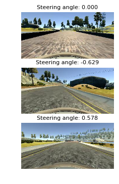
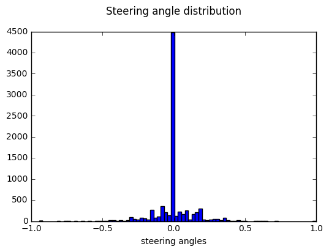
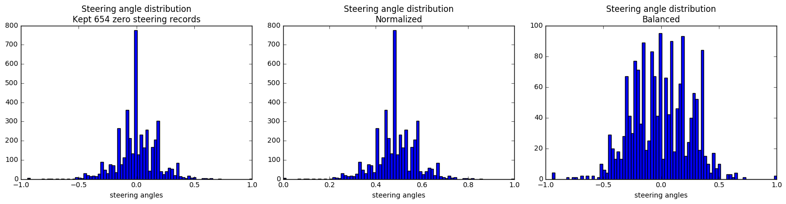
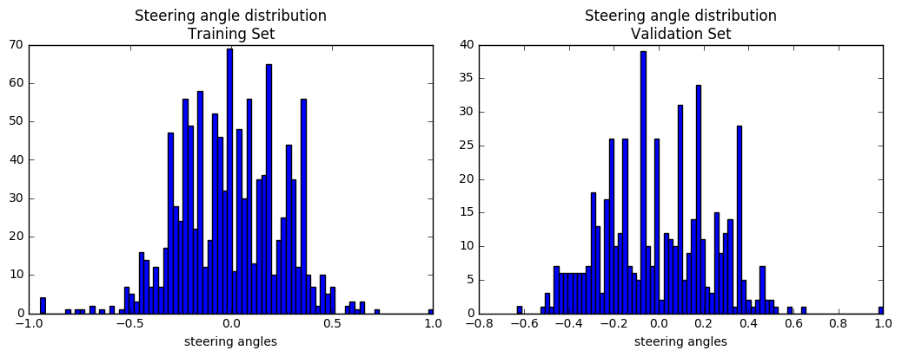
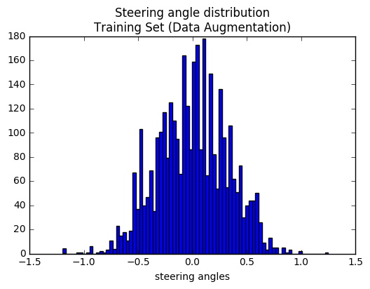
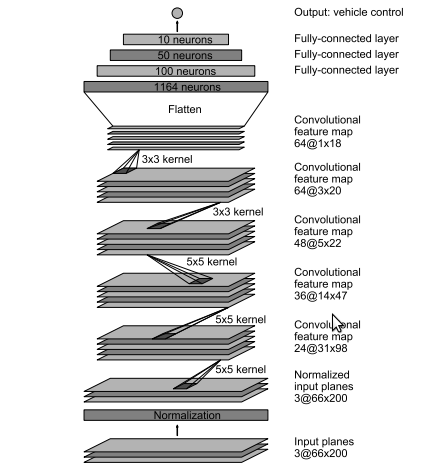
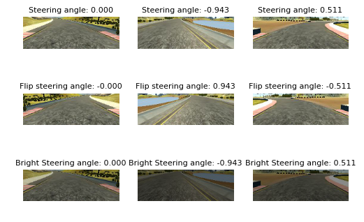
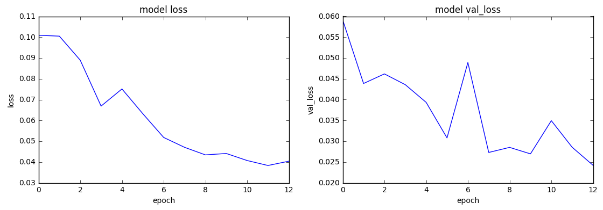
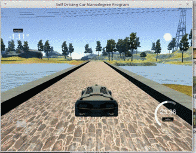

# Behavioral Cloning
Project #3 of Udacity's Self-driving Car Nanodegree Program. The following tools where used:

- Tensorflow 0.12.1
- Keras 1.2.0
- Numpy 1.11.3
- Pandas 0.18.1
- Matplotlib 1.5.3
- Jupyter 4.2.3
- Python 3.5.2

## Get the data
The data used is provided by Udacity, it can be downloaded [here](https://d17h27t6h515a5.cloudfront.net/topher/2016/December/584f6edd_data/data.zip). It contains a set of images recorded by the simulator. It also has a log with information related to every image including the steering angle.

(Image provided by Udacity)

## Visualize the data
The first step is to visualize the dataset to understand the kind of data that is going to be used to create a model.

The histogram of the steering angles shows that there's an important amount of records for the value 0. The number of records is 8036

## Balance the data
Based on the previous histogram, the first strategy is to reduce the number of records for the steering value of 0. Then, based on the new distribution, determine the average and drop reduce the number of records higher than such average. To accomplish this, the records are sorted, normalized (between 0 and 1), and grouped in bins with a width of 0.025. After balancing the data, the number of records is 1693

## Split the data into training and validation sets
The balanced data is then split into training and testing sets. 30% of the records are used for validation. The result is 1162 records for training, and 531 for validation.

## Augment the data (Beforehand)
The dataset provides 3 images for every record, one from the center camera, and the other two from the side cameras. Here, the images of the side cameras are used to generate new records. The images from the left camera correspond to a variation of +.25 in the steering angle, for the images from the right camera the variation is -.25 as stated by the fellow [Vivek Yadav](https://chatbotslife.com/using-augmentation-to-mimic-human-driving-496b569760a9#.ofn8g7j3g). The objective of this strategy is to provide information for recovery, so the car is able to correct its trajectory when it is moving to the side of the road

## Define the architecture
The model is the one defined by Nvidia. It consists of the following components:
 - 5 convolutional layers.
 - 3 fully connected layers.
 - Relu activations.
 - Adam optimizer.

(Image from the Nvidia paper "End to End Learning for Self-Driving Cars")

## Augment the data (On the fly)
Since there is a considerable amount of images used to train the model, and there are some restrictions in memory, it is not possible to pre-process all the data and keep it in memory. To overcome this problem, Keras provide generators which allow data augmentation of images in the CPU while the model is being trained in the GPU.

In this case, there is three kinds of techniques to augment the data:
  - Change brightness. Simply make the images darker or brighter.
  - Flip images horizontally, which makes the corresponding steering angle to be the opposite of its original counterpart.
  - Distort the steering angle by a small factor. Idea of the fellow [Annie Flippo](https://medium.com/@acflippo/cloning-driving-behavior-by-augmenting-steering-angles-5faf7ea8a125#.igtk4gj23)

 The objective of these augmentations is to make the model to generalize better and to avoid overfitting.

 

## Train the model and results

This is a trial-error process where the values for the hyperparameters (Learning rate, training size, batch size, and epochs) are modified until finding the ones that give the desired result. At every iteration, the behavior of the car is evaluated to check the possible causes of error, and a single hyperparameter is modified.

