# Advanced Lane Finding

Project #3 of Udacity's Self-driving Car Nanodegree Program. The following tools were used:

- Numpy 1.11.3
- Matplotlib 1.5.3
- Jupyter 4.2.3
- Python 3.5.2
- MoviePy 0.2.2.11
- OpenCV 3.1.0

## 1. Camera Calibration

The camera calibration process includes the use of 20 images of a chessboard taken from different angles and distances. This process throws a list of the 3D coordinates of the inner corners (object points) in the chessboard along with a list of the corresponding 2D coordinates (image points).

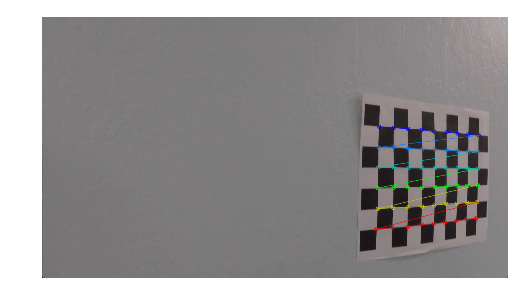

## 2. Distortion Correction
Using the objects points and image points obtained in the previous step, the images taken from the camera are undistorted.

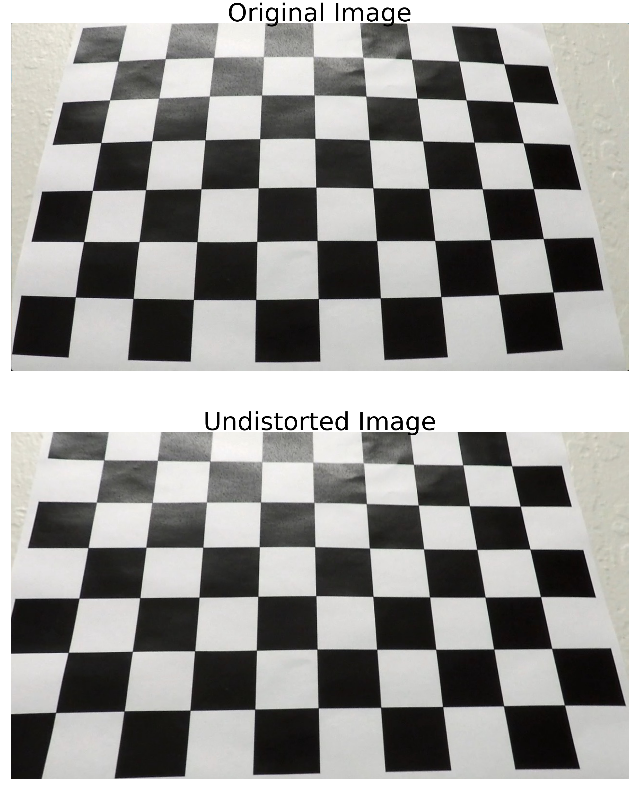

## 3. Perspective Transformation
The images of the road have a perspective which makes the parallel lines to meet in a vanishing point. Therefore, the images need to be transformed so the lane lines are displayed parallel to each other. To do so, four points in the original image are defined; these points form a trapezoid. Other four points are defined; these points form a rectangle. The transformation consists on mapping the former points to the latter ones, so the image is transformed accordingly, and the lane lines look parallel (as they are in the real world).

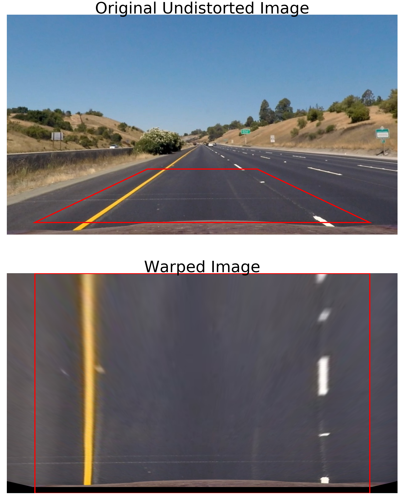

## 4. Gradient thresholding
The gradient thresholding step is aimed to identify edges in the image. Since the lane lines are basically edges in the road, defining a proper thresholding with the corresponding parameters will help to define the lane lines. 

There are several kinds of thresholding that can be used to accomplish the objective. However, after some experimentations, the gradient in the X direction showed to give the best results. Also, in order to get better results, the images were transformed to LUV color space, and the gradient was applied in the V channel which, in this particular case, highlights the yellow color from the rest. This is especially important due to the change of the pavement color which in some parts is quite dark whereas in other places tend to be light gray.

This step makes easier to identify the yellow lane lines.

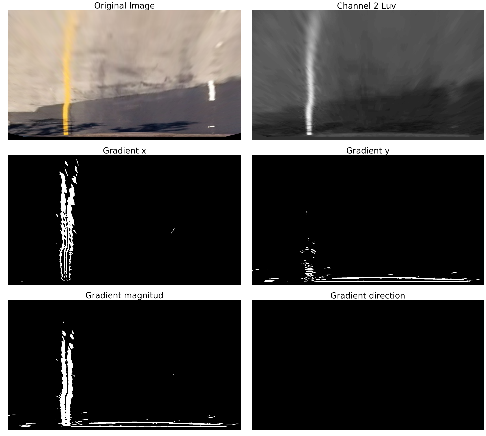

## 5. Color thresholding
In this step, the objective is to identify pixels of a given color. To do so, ranges for the RGB channels are defined. In this project, the lane lines are either white or yellow, so the ranges for those colors are defined as follows:

	Yellow RGB range: (200 - 255, 100 - 255, 40 - 150)
	White RGB range: (190 - 255, 190 - 255, 190 - 255)

Those ranges were set empirically by analyzing the yellow and white lane lines of test images.

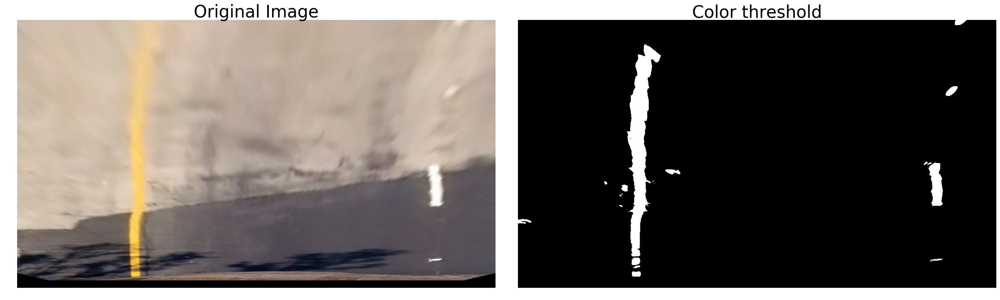

## 6. Combined thresholding
Here the two previous steps are merged, so the yellow and white lines are identified. The final result is a binary image.

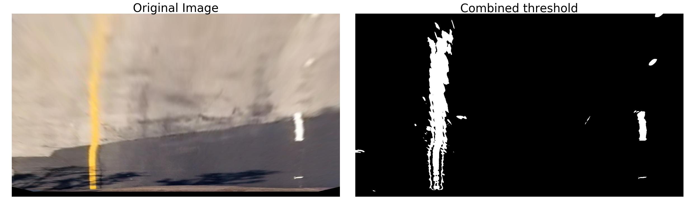

## 7. Filtering
The thresholding step identifies the lane lines, however, some minor spots are also part of the output. These spots are related to irregularities in the pavement or some shadows. The objective in this step is to remove those spots as much as possible to reduce their influence when defining the polynomial of a lane line.

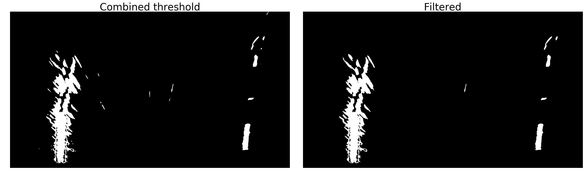

## 8. Lines definition
### 8.1 Definition from raw data
In this step, the goal is to find the polynomials that define the lane lines. This is accomplished by analyzing the histogram of the output image from the previous step. The histogram shows two peaks that correspond to the greatest accumulations of white pixels. These peaks are the starting points to define the lane lines. 

In an iterative process, the coordinates of the white pixels are retrieved. Then, these coordinates are used to find the polynomial that better fits.

### 8.2 Definition using previous polynomials
Once the polynomials of the lane lines have been found in a frame, they can be used to find the polynomials in the next frame by setting a margin to start searching around the previous lines.

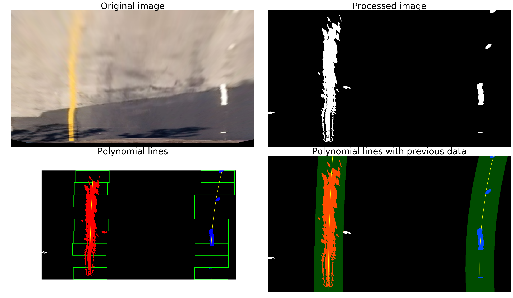

## 9. Measuring radius and offset from lane center
The radius of the curvature of the road is calculated using the method explained [here](http://www.intmath.com/applications-differentiation/8-radius-curvature.php). Then, the value is adjusted to reveal a real world measurement. 

The offset from the lane center is calculated based on the difference of the center of the image and the midpoint of the lowest points of the lane lines defined for their correspondings polynomials. This value is also adjusted for a real world measurement.

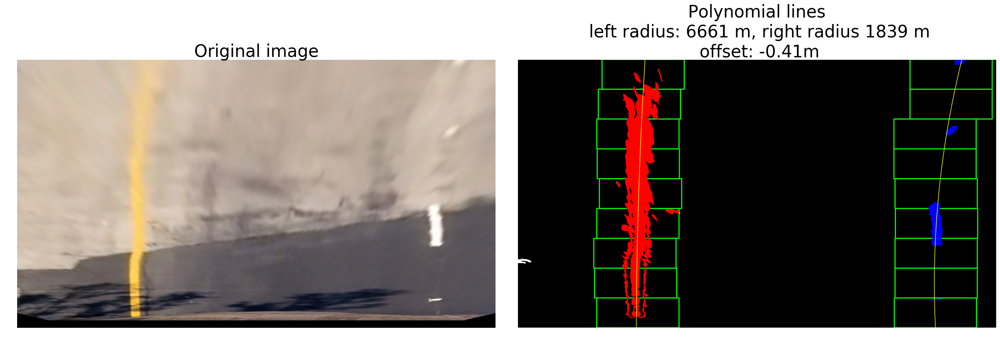

## 10. Check lines for parallelism
The polynomials found should roughly define parallel lines. However, in some cases that does not happen. In these cases, one of the lines has to be corrected. The correction is done based on the number of points used to define the polynomial. It is likely that the polynomial defined with a bigger number of points is closer to the actual lane line. So, the points used for that polynomial are used to correct the other one. These points are displaced the distance between the two peak points in the histogram (to the left or the right).

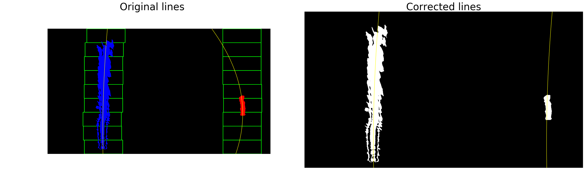

## Final result

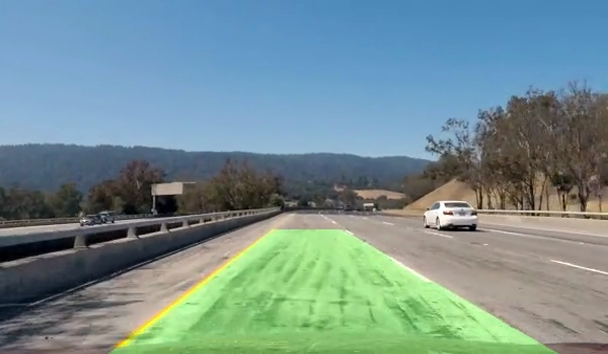

## Pipeline

## Pipeline video
[Video with the final result](https://vimeo.com/202995557) 
[Video with the steps of image processing](https://vimeo.com/202995062)

## Reflection
The development of the project presented challenges in every step, being the most relevant the following:

  * The perspective transformation: In this case, the trapezoid and rectangle defined to perform the transformation have to be big enough to display several parts of the dashed lines. If these shapes are not set correctly, then in some frames there will not be enough information of the dashed lines. Therefore, the polynomial that defines the corresponding line will be not accurate enough.

  * The thresholding process: Here, one of the biggest issues is the definition of the parameters and ranges to recognize the lines. In the case of the gradient thresholding, after some experimentations, the V channel of the LUV color space shows to be very robust to split the yellow parts from the rest. For the white lines, the BGR color space is good enough to find them. Finally, even though the thresholding process is good enough to find the lanes, in some cases several spots that do not have anything to do with the lines are identified. To reduce the influence of those spots in the definition of the polynomials, a filtering process is added to remove the spots smaller than a given size.

  * Checking for parallelism: Each line was found independently from each other. However, in some cases to make sure that the calculated lines were parallel, one of the lines had to be re-calculated with the data used for the other.  

The pipeline development relies on the existence of the lane lines in every frame. This means that if there are no lines in a certain frame, then the algorithm will fail. To overcome this issue, the algorithm should check for the previous frames to determine if that information can be used to define the lane in the current frame.

