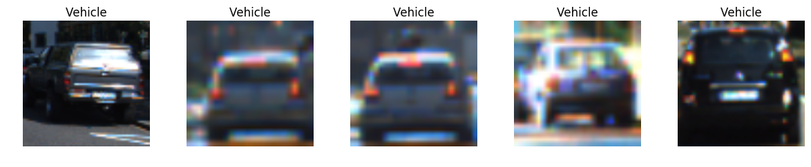

# Vehicle Detection

Project #5 of Udacity's Self-driving Car Nanodegree Program. The following tools are used:

- Numpy 1.11.3
- Matplotlib 1.5.3
- Jupyter 4.2.3
- Python 3.5.2
- MoviePy 0.2.2.11
- OpenCV 3.1.0
- Tensorflow 0.12.1
- Keras 1.2.0

## 1. Load data

There are 8792 vehicles and 8968 non-vehicles. The dataset is roughly balanced, so there is no need to modify the original data in regards to that matter.

## 2. Extract features
### 2.1 Image preprocessing

Before extracting the features of the images some preprocessing needs to be done in order to highlight the characteristics of the pictures.

In this case, the contrast of the images are increased by equalizing the histogram of every channel. 

Two methods are tried. The first one increases the global contrast of the image. The second one splits the image into regions, and increases the local contrast of those regions, this method is called CLAHE (Contrast Limited Adaptive Histogram Equalization)

Global contrast and clahe do a good work by highlighting the features of the images. However, global contrast adds some unnecessary noise to the resulting pictures.

### 2.2. Histogram Of Gradients
Now, it is time to compute the gradients of the pixels for both classes. The gradients are computed over the grayscale version of the processed image.

### 2.3 Final features

The HOG process outputs 1764 features. This value is obtained from the parameters used to perform HOG. Nine orientations are good enough to determine the direction of the gradients in every cell (as stated in the theory). The number of pixels in every cell is eight to ensure that all the pixels are used (the dimensions of the images used to train the model is 64x64). Then every block is made of two cells horizontally and vertically which results in 7 blocks in every direction. 

7 vertical blocks x 7 horizontal blocks x 2 horizontal cells per block x 2 vertical cells per block x 9 orientations = 1764 features

Other values can be added including the colors histograms, however the number of features thrown by HOG are good enough to train the classifier.

### 2.4. Normalization

This step is meant to reduce the influence of features with high values when training the model. Therefore, the normalization allows that all components have roughly the same influence in the entire set.

## 3. Select and train a classifier
There are some classifiers that can be used for object recognition including Decision Trees and Support Vector Machines. Nonetheless, a deep neural network is used to detect vehicles. The architecture is composed of eight hidden layers with RELU activations after each one; an Adam optimizer is used as the Gradient Descent scheme.

As shown by the previous plots, the model reaches a very good accuracy ~0.99. This value is reached by increasing the number of hidden layers and adding RELU activations after each one.

## 4. Slide image
Define the sections of the image that will be used as input for the trained model to detect the presence of a vehicle.

### 4.1 Define the region of interest

In order to increase efficiency, a region of interest will be defined. This space is where it is more likely to find a vehicle. The sliding will be done in this area.

The previous images show that a factor of .55 defines very well the area of interest. This factor means that 55% (upper side) of the image won't be part of the sliding. The same is true for the second factor, in this case, the best factor is 10%. This means that 10% (lower side) of the image will not be used for sliding.

### 4.2 Multiscale and Overlapping
Because of the effect of the perspective in the images, objects that are far from the camera look smaller. In addition, in this particular project, vehicles in front of the camera does not look similar to vehicles located to the left of the right; cars in the latter positions show more of their structure, not just the rear part.

The overlapping process ensures redundancy when detecting vehicles and discards false positives through the use of a heat map.

Based on the previous assumption, segmenting the area of interest requires different sizes of the windows to do so.

#### 4.2.1 Vertical segmentation

The segmentation of the image is done in a geometric way by determining the best ratio between segments. All the segments are overlapped. The objective is to find the best ratio and number of segments for the region of interest.

After analyzing the results of the previous images, the best configuration for the vertical segmentation is the following:

- Number of segments: 5
- Reduction ratio: 0.7
  
Reduction ratio represents how big is the next segment compared to the previous one, in this case, the height of the second segment is 70% the height of the first segment.

#### 4.2.2 Horizontal segmentation

For the sake of simplicity, the horizontal segmentation will be done based on the vertical segmentation. The height of a vertical segment will be used for the width of a box used to "patch" that segment. During this process, an overlap factor is needed so two continous segments share the same area.

#### 4.2.3 Combined segmentation

Simply combine vertical and horizontal segmentation

## 5. Vehicle detection

Here, the images are segmented based on the scheme described above. Then, every segment is pre-processed to adjust the contrast (clahe) and the size, so the features can be extracted. 

The features are passed to the classifier which determines the corresponding class for that segment. Every segment that is classified as vehicle is passed to a heat map. The area covered by the segment increases its intensity.

Finally, a threshold is applied to the heat map to filter the areas with less intensity (which are likely to be false positives). The result of this process corresponds to the areas where vehicles are located.

## 6. Video pipeline

Here the process is the same presented in step 5 with a couple of additions. First, an accumulation heat map is used to determine the presence of a vehicle in a frame based on the results in previous frames. This accumulation heat map is also filtered with a threshold to discard the less intense areas. The number of accumulated frames along with the threshold are parameters to tweak.

Based on the previous explanation, there are two heat maps in every frame. The first one is the independent heat map of each frame, and the other is the heat map of the accumulation over the last previous frames.

In order to increase the speed of the process, the raw detection of vehicles (by segmenting the frame) is done every three frames, in the rest of the frames, the detection is done based on the result of the previous frame.

## 7. Discussion

There are several things to highlight in this project:
  * I studied the images in several color spaces, I even used some of the channels of those color spaces to get the histograms and add them as features. However, these features did not add any relevance when detecting vehicles, they even caused a lot of false positives. The reason for this is that there was no a clear distinction between the channels histograms in the vehicles and the non-vehicles classes.
  
  * When selecting the classifier, I tried other alternatives including Decision Trees, SVM, and Adaboost. Even though these classifiers are commonly recognized as good for object detection, in this particular case I faced two problems:
      * Training time: Decision Trees are fast, but Adaboost and SVM took to much time to get a decent result.
      * Accuracy: Adaboost and SVM threw good accuracy results. On the other hand, Decision Trees did not reach reliable results.
      
    So, the previous models showed a tradeoff between training speed and accuracy. Both problems were solved with a deep neural network.

  * The objective of overlapped windows is to create redundancy to recognize vehicles and discard false positives. However, this comes with a price: processing speed. The more the ovelapping area between segments, the more the segments to process.
  
  * Other parameters that increase the accuracy of the solution are the accumulation heat map and the heat map thresholds. The first one, in my personal analysis, should depend on the speed of the car. The higher the speed of a car the higher the variation from frame to frame, and the lower the similarity between them. Remember that this parameter relies in the results of the previous frames. 

    The threshold of the heat maps is a value that depends on the overlaping areas. The bigger the overlaping area the higher the redundancy when detecting vehicles, therefore the higher the intensity of the heatmap.
