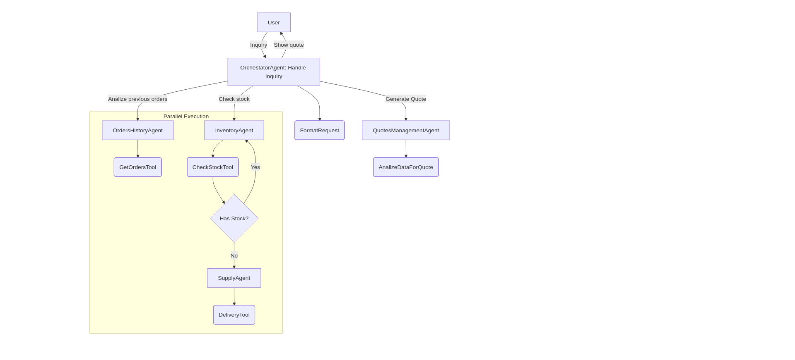

### Summary

In this project, I implemented a solution to manage the operations of the The Beaver's Choice Paper Company. The solution relies on a multi-agent architecture aimed at automating the workflow of generating a quote for a client. The automation starts with an inquiry from the client, after several operations done by the systems, the client receives a proper quote.

### Multi-agent architecture

The architecture of the solution is relies in an orchestator that assigns tasks to different agents a seen in the figure below

The worflow is the following:

0. User makes an inquiry
1. **Orchestator** receives the inquiry and formats it to a structured format
2. The formatted inquiry paased to the **QuotesHistoryAgent** to find similar past quotes
3. Parallely, the formatted inquiry is passed to the **InventoryAgent** to verify the stock.
4. If the stock is insufficient, the **SupplyAgent** creates an order for the required items
5. With the outputs of the previous agents, the **QuotesManagementAgent** creates a quote for the client
6. The **Orchestator** presents the quote to the user in a friendly manner.

### Implementation

The implementation used the codebase given by Udacity alog with the capabilities of a framework like [smolagents](https://huggingface.co/docs/smolagents/index). Despite some limitations, smolagents is a friendly alternative for newcomers and a good option to rapid prototyping. 

### Iterations

After several iterations, the system was fine-tunned to improve their performance. Among the several changes, the most revelevant were the following:

- Remove **QuotesHistoryAgent** and integrate its functionality into **QuotesManagementAgent**. The rationale behind this change is that **QuotesManagementAgent** must be in charge of anything related to quotes: retrieval, creation, persistence. So, the context of this agent is really quotes management. Moreover, the requirements limited the number of agents to 5.

- Create data types for the outputs of the agents. The limited capabilities of smolagents to output structured responses proved to be one of the most challenging areas of the implementation. This limitation was overcame by using data types along with detailed prompts to guarantee inter-operability among agents.

### Future improvements

The solution has many opportunities to improve its operations. One of the first things to improve is to guarantee structured outputs to pass data among agents. The quotes generated by the system need to consider additional parameters such as seasons, recurrent orders, discounts based on fidelity and more. 

### Conclusion

This project has been a good exercise to test the skills and knowledged acquired throughout the lessons. After this project, I see the benefits of using agents to automate a process. I also understand that a solution is an interative process where issues are solved and new features implemented. Despite the advantages of using AI agents, there are some things that may need further thinking to see if a more traditional solution is a better fit for a problem. My take-away of this course is that AI agents are a powerful tool that needs careful implementation and integration with existing software.